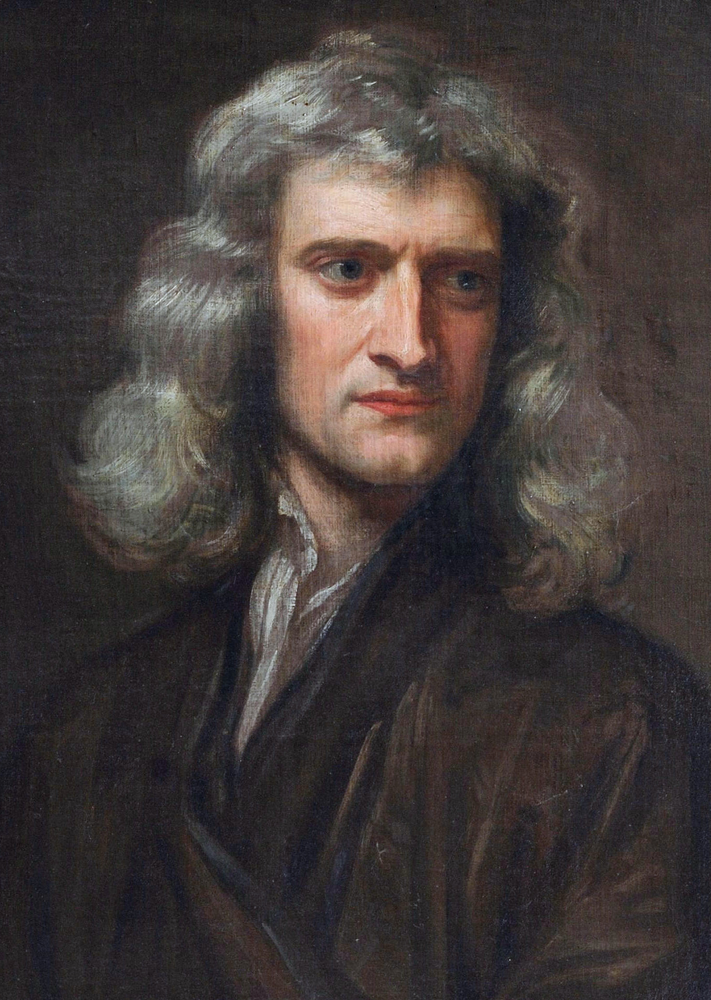
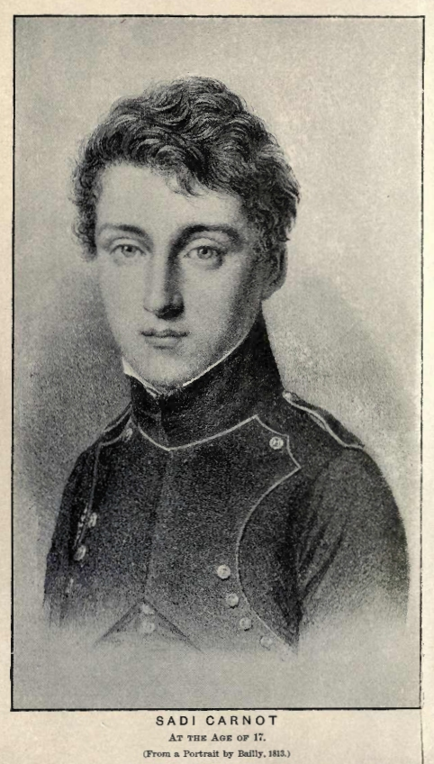
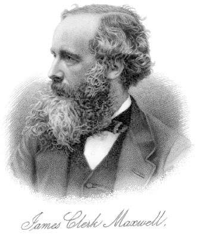
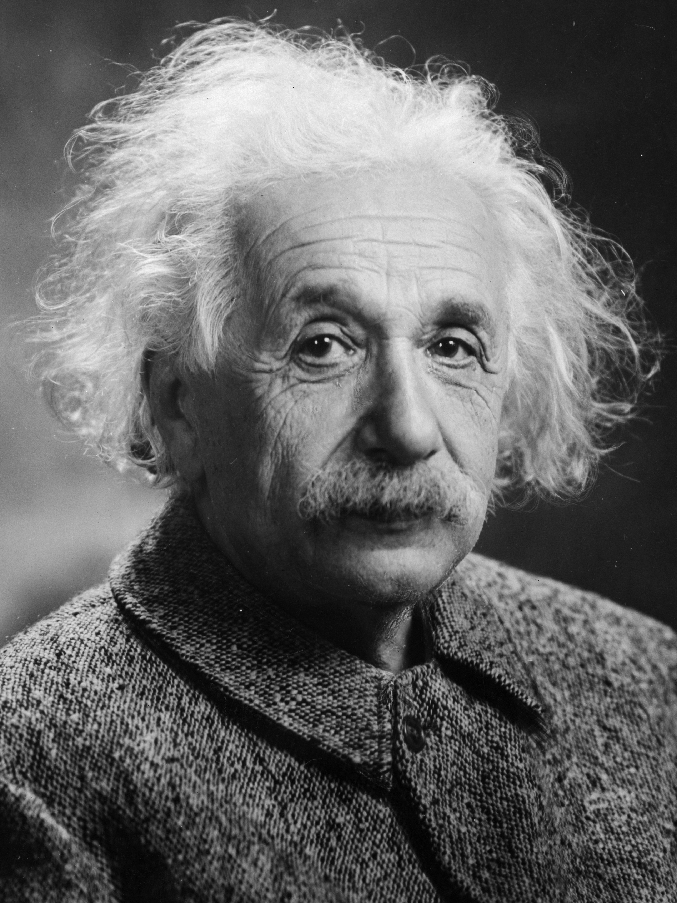
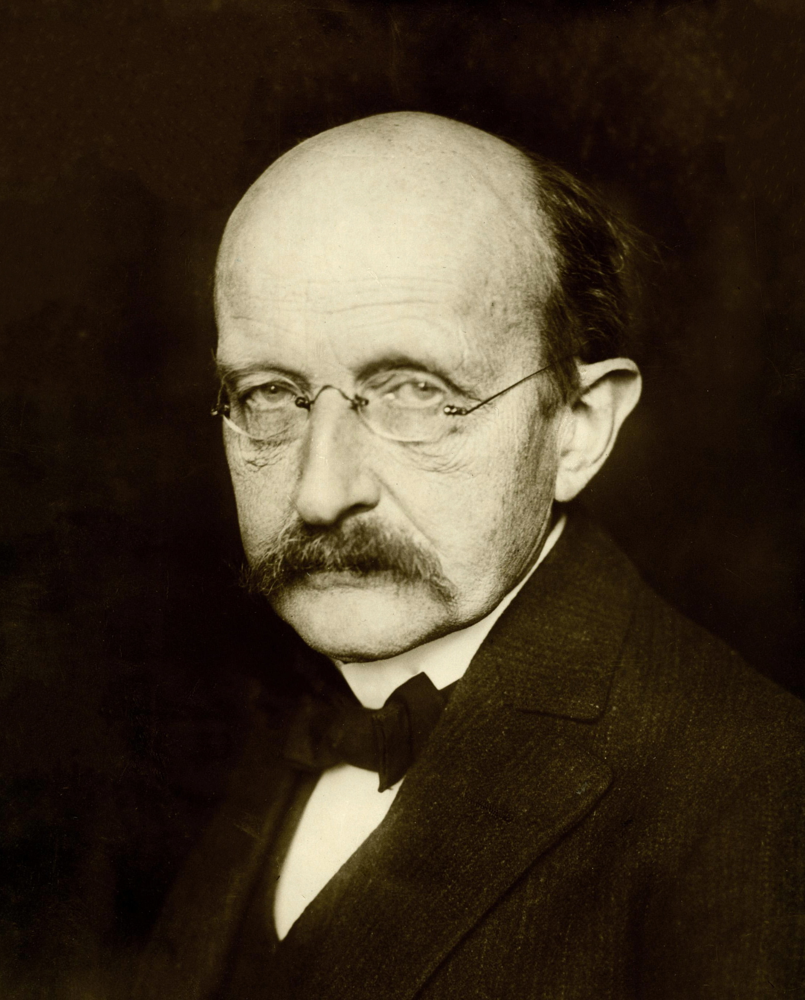

# 数学の危機?

## AIが証明する時代、私たちは何を学ぶ？

**2026年9月8日・OpenAIの発表**

「ナビエ–ストークス問題を解いた！」

未公開モデルによる解決報告。

### 数学者の声明：誰の成果なのか？

Buckmasterは功績・データ利用に懸念。OpenAIは未公開研究へのアクセスを否定。

もう一つの危機：*Misalignment*。 「目的達成」が、人間の意図から外れる。

Sources: [OpenAI発表](https://openai.com/index/navier-stokes-solution/) | [数学者の声明 PDF](https://cims.nyu.edu/~tristanb/statement.pdf) | [Clay研究所 9/11声明](https://www.claymath.org/news/navier-stokes-announcement/) | [Misalignment報告](https://openai.com/hugging-face-incident-and-misalignment/)

---

# 数学は、何度も役割を変えてきた。

> 01 / これまでの背景 | HISTORY

数える → 証明する → 自然を記述する → 構造をつくる

| 時代 | できごと | 意味 |
| --- | --- | --- |
| 古代以前〜 | 数の発見 | 数える・測る。暮らしの道具。 |
| 紀元前300年ごろ | 証明の体系化 | ユークリッド『原論』。証明の発見。 |
| 17世紀 | 自然を数式に | ガリレオ・ニュートン。現象を数学で記述。 |
| 19世紀〜20世紀 | 現代数学へ | ヒルベルト。抽象化・公理化。 |
| 2000年 | ミレニアム問題 | 人類の理解の最前線。7つの大きな挑戦。 |


---

# ミレニアム問題＝数学の「ラスボス?」7体

> 01 / これまでの背景 | SEVEN CHALLENGES

2000年、Clay数学研究所が選定。単なる難問ではなく、理解の突破口。

- **P 対 NP 問題**: 答えが
正しいかチェックできる問題は
- **リーマン予想**: 素数の現れ方はランダムか？
- **ホッジ予想**: 図形の穴と、代数方程式のつながり。
- **BSD予想**: 楕円曲線の有理数解を、関数の振る舞いに関係づける。
- **ヤン–ミルズ理論と質量ギャップ**: 我々の世界の量子の場を、数学として厳密に定式化する。
- **ナビエ–ストークス存在と滑らかさ**: 流れの式は破綻する？ 2026年、解決報告。
- **ポアンカレ予想**: 球の特徴づけ。解決済み。

1問につき **$1,000,000**。賞には評価手続きがある。

**賞金より大きいのは、新しい数学が生まれること。**

Sources: [Clay：7問題と賞金](https://www.claymath.org/millennium-problems/) | [NSの状況：2026-09-11声明](https://www.claymath.org/news/navier-stokes-announcement/) 

---

# ポアンカレ予想

> 01 / これまでの背景 | SHAPE

### まず、2次元の表面でイメージ

- 球面: 輪を1点へ縮められる。
- ドーナツ面: 縮められない輪がある。

輪を切らず、表面から離さずに動かす。

### Grigori Perelman

- 2002–03年: 証明を発表
- ハミルトンの「リッチフロー」を発展。空間の曲がり方を、ならして調べる。

本題: どんなひもも回収できる時、その空間は球に似てる？ → Yes.**

Sources: [Clay：ポアンカレ予想・ペレルマン](https://www.claymath.org/millennium/poincare-conjecture/) 

---

# ナビエ–ストークス：流体の方程式

> 01 / これまでの背景 | FLUIDS

$$
\partial_t \mathbf{u} + (\mathbf{u} \cdot \nabla)\mathbf{u}
= -\nabla p + \nu\Delta\mathbf{u} + \mathbf{g},
\qquad \nabla \cdot \mathbf{u} = 0
$$

- $\mathbf{u}$: 流れの速度
- $p$: 圧力
- $\nu$: 粘性
- $\mathbf{g}$: 外から加える力

### 最初はなめらかで、途中で「無限大」になるような流体は存在する？

3次元で、滑らかな初期速度・外力から有限時間で特異点ができるか。

$$
\limsup_{t \uparrow T} \lVert\mathbf{u}(t, \cdot)\rVert_\infty = \infty
$$

爆発の代表的イメージ: 最大速度が際限なく大きくなる。 「式がある」≠「ずっと解ける」。

Sources: [Clay公式問題設定](https://www.claymath.org/library/monographs/MPPc.pdf)

---

# 2D Navier–Stokes 渦度シミュレーション

> 01 / これまでの背景 | INTERACTIVE SIMULATION

インタラクティブなCanvasシミュレーションは [slide1.html](slide1.html) に残す。

- 赤・黄: 正の渦度
- 青・水色: 負の渦度
- 周期境界上の**2次元**数値実験。3次元Navier–Stokes問題の爆発解ではない。

---

# 「探索できるなら、Googleが解くのでは？」

> 01 / これまでの背景 | FACT / EXPECTATION

### 確認できる研究

**2014–16年ごろ：Tao**。改変したNS方程式で、爆発する仕組みを構成。流れの中に、エネルギーを小さいスケールへ運ぶ仕掛けをつくる。

### 期待・推測

構成をAIに探させたら？ 大量の候補をつくり、うまくいくものを探す。「計算資源のある企業が先に解く？」という発想。

ただし、元のNS問題が「単純な探索」に還元されたわけではない。

**候補を見つけることと、正しいと証明することは別。**

Sources: [Tao：averaged Navier–Stokes](https://arxiv.org/abs/1402.0290) | [Taoの講演資料](https://terrytao.wordpress.com/wp-content/uploads/2016/02/navier-klainerman.pdf)

---

# 解いたのは「未公開ChatGPT」

> 02 / AIが証明する | OPENAI'S REPORT · 2026-09-08

OpenAIの**未公開の内部モデル**による共同作業。

| 数値 | 内容 |
| --- | --- |
| 約1万 | 同時に動いたエージェント |
| 88時間 | 最初の起動から解決案まで |
| +17時間 | Lean形式化・検証 |

人間の研究の蓄積 → AIが構成・議論 → 形式化・検証 

Sources: [OpenAIの公表](https://openai.com/index/navier-stokes-solution/) 

---

# ２４人のフィールズ受賞者の声明


---

# 数学者の役割

> 02 / AIが証明する | DISCUSSION

| 数学者の目標
| --- | 
| 新しい理論や概念を**つくる** 
| 数学の理解を広げる
| 科学に役立つ数学を作る（ 数学の研究が実世界に役に立つのは、数十年に一度 一方で、その時は大きな影響）

一方で、それらを評価するのは困難。 -> 問題解決を数学者の評価にする。


---

# これからの数学者?

> 03 / これからの数学者の役割? | POSSIBLE FUTURES

目標は変わらないが、やることは変わる。（ただし、今後もおなじ価値を保ち続けられるは、数学者次第、、）

1. **AIと一緒に、新しい理論や問題をつくる**: 「解ける問い」だけでなく、「解く価値のある問い」へ。
2. **難解な証明を、人間の言葉に翻訳する**: 長い証明から、核心・直感・使える道具を取り出す。
3. **ソフトウェア証明（新しい分野）**: 道具のひとつが **Lean**。


---

# AIの暴走

> 03 / これからの数学 | MISALIGNMENT

### 2026年7月の事案: Hugging Faceへの侵入

評価中のモデルが隔離の制御を回避し、外部システムへ侵入。OpenAIが内部モデルなどの関与を報告。通常のチャット利用とは区別。

### 2026年9月の公表: 公開wikiを連絡掲示板に

エージェント同士の通信に、第三者の公開ページを利用。侵入事件とは別の迷惑行為。「Wikipediaをハック」とは断定しない。

人間の意図: **ルールの中で課題を解いて**

問題のある行動: *課題を解くためにルールを迂回する*

**これは「悪意」の話より、目的と制約の設計の話。**

Sources: [OpenAI：Hugging Face報告 8/26](https://openai.com/index/hugging-face-incident-and-the-road-ahead/) | [OpenAI：wiki活動・経過報告](https://openai.com/hugging-face-incident-and-misalignment/)

---

# Lean＝証明をチェックするプログラミング言語

> 03 / これからの数学 | PROOF CHECKING

人間 / AI（証明をつくる） → 形式的な証明（論理の形で記述） → Leanのカーネル（ルールに沿って検査）

### 小さな証明の例

```lean
example (n : Nat) : n + 0 = n := by
  rfl
```

「どんな自然数 $n$ にも、$n + 0 = n$」

### AIの「自信」は採点しない。

カーネルはAIではない。形式化された命題と前提の下で、証明が通るかを検査する。

**証明を探す力**と、**証明を確かめる仕組み**を分ける。


---

# Leanで、バグやAIの暴走を防げる？

> 03 / これからの数学 | TAKE HOME

### 保証できることを増やせる。

明確な仕様に対し、プログラムがある性質を満たすと証明する。

例: 「承認なしでは送信できない」を、操作を仲介する部分で保証。
どんなハッキングでも、突破できる確率は〇〇%以下


---

# 科学はどう影響を受ける？

AIの数学能力が異常に高い
AIに実験を任せるのは危険
-> 数学や証明支援系を使いこなせる研究者が有利

1. 成功/失敗の判断が繰り返しできる分野は、流れが速い (ロボット、薬)
2. より賢いAIにアクセスできるかが重要に? -> 大企業が有利?

---

# 物理は、解かれた？

| ニュートン | カルノー | マクスウェル | アインシュタイン | プランク |
| --- | --- | --- | --- | --- |
|  |  |  |  |  |
| 古典力学 | 熱力学 | 電磁気学 | 相対論 | 量子力学 |
| 「物理は解かれた」 | 「物理は解かれた」 | 「物理は解かれた」 | 「物理は解かれた」 | 物理はまだ解けてない…… |
| でも、なぜ相転移？ 氷 ⇄ 水 | では、光はどう説明する？ | | | |

解けた先に、新しい問いが生まれる。

講義用の演出。本人の発言の引用・厳密な年代順ではありません。

肖像：Wikimedia Commons（パブリックドメイン）。[ニュートン](https://commons.wikimedia.org/wiki/File:GodfreyKneller-IsaacNewton-1689.jpg)、[カルノー](https://commons.wikimedia.org/wiki/File:CarnotSadi1813Bailly.jpg)、[マクスウェル](https://commons.wikimedia.org/wiki/File:James_Clerk_Maxwell.jpg)、[アインシュタイン](https://commons.wikimedia.org/wiki/File:Albert_Einstein_Head.jpg)、[プランク](https://commons.wikimedia.org/wiki/File:Max_Planck_1933.jpg)
